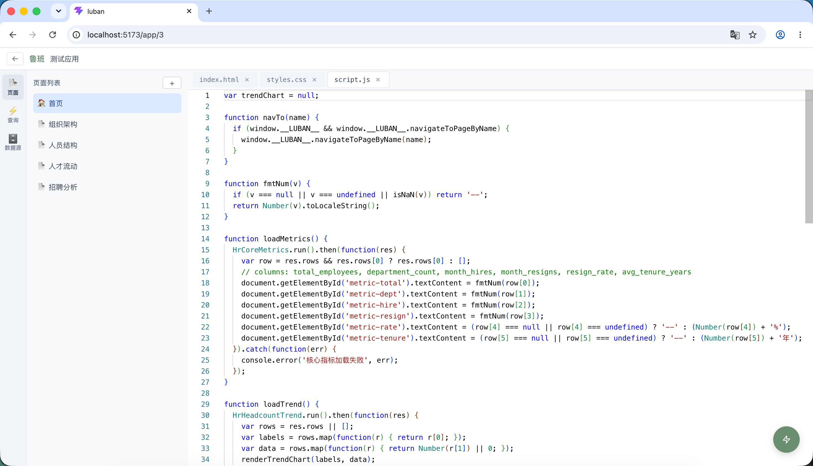
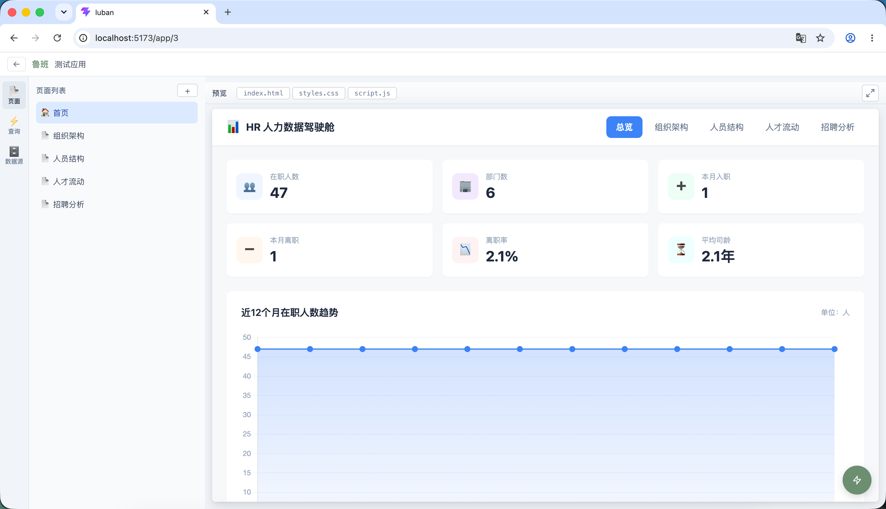
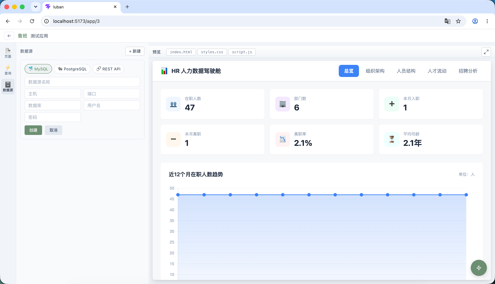
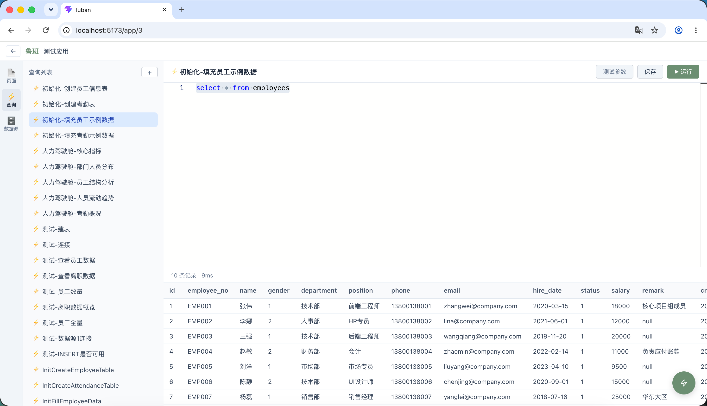
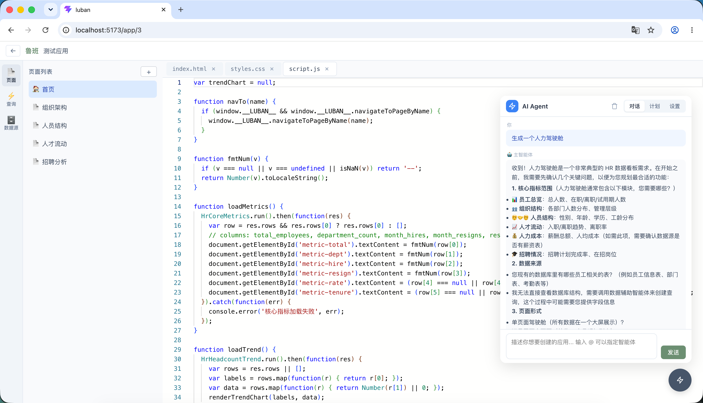
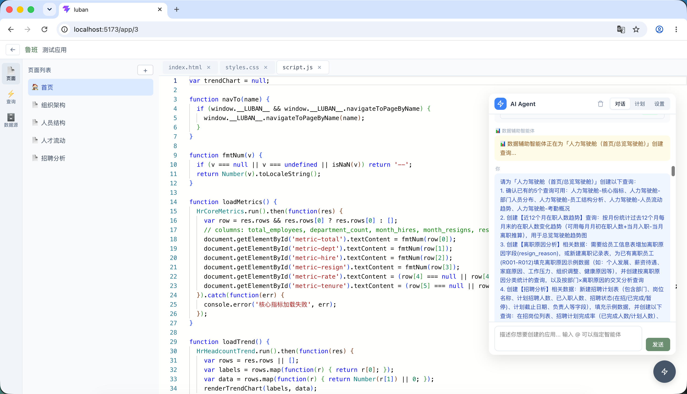

<p align="center">
  
</p>
<h1 align="center">鲁班 Luban</h1>
<p align="center"><strong>企业 Agent 的操作系统 — 连接 · 问数 · 开发</strong></p>

---

> 📐 **产品定位**：鲁班是企业 AI 的操作系统，向下连接企业系统（HTTP/SQL/MCP），将传统 API 转化为 MCP 工具，向上通过 A2A 协议接受企业 Agent 委派。现有平台实现了三大核心能力中的「开发」模块，正在补齐「连接」和「问数」。
>
> 📋 **完整需求文档**：[鲁班-整体工作计划](doc/需求文档/鲁班-整体工作计划.md) | Sprint 详细设计：[Sprint 1](doc/需求文档/sprint/sprint-1-mcp-base.md) · [Sprint 2](doc/需求文档/sprint/sprint-2-batch-security.md) · [Sprint 3](doc/需求文档/sprint/sprint-3-ai-orchestration-inquire.md) · [Sprint 4](doc/需求文档/sprint/sprint-4-algorithm-plugin.md)
>
> ⚠️ **项目状态：Sprint 1 开发中** — 当前正在建设 HTTP 执行器和工具注册表，连接企业系统，欢迎 ⭐ Star 关注进度！

---

## 截图

<p align="center">
  
  
</p>
<p align="center">
  
  
</p>
<p align="center">
  
  
</p>

---

## 简介

**鲁班（Luban）** 是企业 Agent 的操作系统，围绕三大核心能力构建：

| 能力 | 说明 | 状态 |
|------|------|:--:|
| 🔌 **连接** | MCP 网关、系统接入、身份认证、权限管控、安全防护 | 🚧 建设中 |
| 🔍 **问数** | NL2SQL 自然语言查询、归因分析（知识图谱 + LLM） | 📋 规划中 |
| 🛠️ **开发** | 工具开发、可视化看板、流程编排、算法插件 | ✅ 已上线 |

### 为什么选择鲁班？

- 🔌 **连接一切业务系统** — 通过 MCP 协议，企业 Agent 可以像调用函数一样调用业务系统的 API 和数据库查询，零代码接入
- 🔍 **用自然语言查数据** — 不需要写 SQL，对着 Agent 说"昨天 3 号车间产量"就能得到结果，支持归因分析（"为什么下降了"）
- 🛠️ **所见即所得开发** — AI 驱动的低代码平台，几分钟内从零到一：建表 → 配数据源 → AI 生成页面 → 发布上线
- 🤖 **AI Agent 全程陪伴** — 内置 AI Agent 对话面板，支持 ReAct 推理和 Plan-Execute 规划执行两种模式
- 🔒 **隐私安全第一** — 浏览器端 Agent 的 API Key 仅存本地，内部 Agent 调用走 JWT 认证，外部 Agent 调用走 API Key 认证
- 🏗️ **灵活可扩展** — 支持自定义 HTML/CSS/JS，不锁死模板，专业开发者也能深度定制

---

## 技术栈

| 层级 | 技术 |
|------|------|
| **前端** | React 19 + TypeScript + Vite 8 |
| **状态管理** | Zustand |
| **代码编辑器** | Monaco Editor |
| **AI Agent** | 纯浏览器端运行（ReAct + Plan-Execute） |
| **后端** | Java 21 + Spring Boot 3.3.2 |
| **ORM** | Spring Data JPA + Hibernate |
| **数据库** | MySQL 8.0 |
| **认证** | Spring Security + JWT |

---

## AI Agent 架构

鲁班支持两种 Agent 接入方式：

```
┌──────────────────────────────────────────────────────────────────┐
│  外部 Agent（Claude Desktop / 飞书机器人 / 企业自研）              │
│  ┌────────────────────────────────────────────────────────────┐  │
│  │  Agent 推理 → 工具调用                                       │  │
│  │       │                                                     │  │
│  │       │  MCP 协议（JSON-RPC over SSE）                        │  │
│  │       ▼                                                     │  │
│  │  ┌──────────────────────────────────────────────────────┐  │  │
│  │  │              鲁班 MCP 网关（北向入口）                  │  │  │
│  │  │   · tools/list 发现工具 · tools/call 调用工具           │  │  │
│  │  │   · API Key 认证                                      │  │  │
│  │  └──────────────────────────────────────────────────────┘  │  │
│  └────────────────────────────────────────────────────────────┘  │
│                                                                   │
│  内部 Agent（鲁班 Web 界面）                                       │
│  ┌────────────────────────────────────────────────────────────┐  │
│  │  浏览器                                                        │
│  │  ┌─────────┐  ┌──────────┐  ┌─────────┐                    │  │
│  │  │ 思考推理 │→│ 工具调用  │→│ 观察反馈 │  ReAct/Plan-Execute │  │
│  │  └─────────┘  └──────────┘  └─────────┘                    │  │
│  │       │                                                     │  │
│  │       │  POST /api/v1/mcp/internal/tools/call（JWT 认证）     │  │
│  │       ▼                                                     │  │
│  │  ┌──────────────────────────────────────────────────────┐  │  │
│  │  │              鲁班 后端（工具执行器）                    │  │  │
│  │  │   · HTTP 执行器 · SQL 执行器 · 工具注册表               │  │  │
│  │  └──────────────────────────────────────────────────────┘  │  │
│  └────────────────────────────────────────────────────────────┘  │
└──────────────────────────────────────────────────────────────────┘
```

### Agent 模式

| 模式 | 说明 | 适用场景 |
|------|------|----------|
| **ReAct** | 思考→行动→观察 循环推理，边想边做 | 页面生成、样式调整、Bug 修复 |
| **Plan-Execute** | 先制定完整计划，再逐步执行 | 复杂任务、多步骤操作 |

### 多智能体协作架构

鲁班内部采用主从式多智能体架构，主智能体负责调度和开发，子智能体负责专项任务。

```
用户请求
    │
    ▼
┌─────────────────────────────────────────────────────────────────┐
│  主智能体（main-agent）                                           │
│  职责：需求澄清 → 调度子智能体 → 确认计划 → 执行开发               │
│                                                                   │
│  持有工具：                                                       │
│  ├─ 页面管理：create_page / delete_page / rename_page / list_pages│
│  ├─ 代码生成：create_code_page / get_code_page / update_code_page │
│  ├─ 计划管理：create_plan / update_plan / update_plan_item        │
│  │           confirm_plan / validate_plan / adjust_plan           │
│  └─ 委派工具：analyze_requirement / delegate_query / find_workflow    │
│                                                                   │
│  ┌─ 委派 ─────────────────────────────────────────────────────┐  │
│  │                                                            │  │
│  │  ┌─────────────────────────┐  ┌─────────────────────────┐ │  │
│  │  │ 需求分析助手              │  │ 数据辅助智能体            │ │  │
│  │  │ (analysis-assistant)    │  │ (data-assistant)        │ │  │
│  │  │                         │  │                         │ │  │
│  │  │ 工具：                   │  │ 工具：                   │ │  │
│  │  │ create_plan             │  │ list_datasources        │ │  │
│  │  │ update_plan             │  │ test_datasource         │ │  │
│  │  │ adjust_plan             │  │ fetch_datasource_       │ │  │
│  │  │                         │  │   structure             │ │  │
│  │  │ 能力：                   │  │ list_queries            │ │  │
│  │  │ 话题拆解                 │  │ create_query            │ │  │
│  │  │ UI 分析（ASCII 布局）     │  │ update_query            │ │  │
│  │  │ 数据分析（业务视角）       │  │ delete_query            │ │  │
│  │  │ Query 分析（输入/输出）    │  │ run_query               │ │  │
│  │  │ 流程分析（表单/审批）      │  │ connect_datasource      │ │  │
│  │  │ 冲突合并                 │  │                         │ │  │
│  │  │                         │  │                         │ │  │
│  │  │ 无数据库知识，纯业务分析   │  │ 连接数据源、创建查询、    │ │  │
│  │  │                         │  │ 执行调试                  │ │  │
│  │  └─────────────────────────┘  └─────────────────────────┘ │ │  │
│  │                                                            │ │  │
│  │  ┌─────────────────────────┐                               │ │  │
│  │  │ 流程设计助手              │                               │ │  │
│  │  │ (workflow-assistant)    │                               │ │  │
│  │  │                         │                               │ │  │
│  │  │ 工具：design_workflow    │                               │ │  │
│  │  │ design_form             │                               │ │  │
│  │  │ search_members          │                               │ │  │
│  │  │ search_departments      │                               │ │  │
│  │  │ search_roles            │                               │ │  │
│  │  │ list_pending_tasks      │                               │ │  │
│  │  │ approve_task / reject_  │                               │ │  │
│  │  │   task / add_sign /     │                               │ │  │
│  │  │   delegate_task         │                               │ │  │
│  │  │ freeze_instance /       │                               │ │  │
│  │  │   unfreeze_instance     │                               │ │  │
│  │  │ copy_workflow /         │                               │ │  │
│  │  │   copy_form             │                               │ │  │
│  │  │ lint_form_code /        │                               │ │  │
│  │  │   lint_workflow         │                               │ │  │
│  │  │                         │                               │ │  │
│  │  │ 能力：表单设计、流程设计、  │                               │ │  │
│  │  │ 组织查询、审批管理、       │                               │ │  │
│  │  │ 流程运维、代码校验         │                               │ │  │
│  │  └─────────────────────────┘                               │ │  │
│  └────────────────────────────────────────────────────────────┘  │
└─────────────────────────────────────────────────────────────────┘
```

#### 智能体总览

| ID | 名称 | 角色 | 工具数 | 委派方式 |
|----|------|------|:--:|------|
| `main-agent` | 主智能体 | 调度 + 开发 | 19 | — |
| `analysis-assistant` | 需求分析助手 | 业务分析 + 计划创建 | 8 | `analyze_requirement` |
| `data-assistant` | 数据辅助智能体 | 数据源管理 + 查询创建/删除 | 9 | `delegate_query` |
| `workflow-assistant` | 流程设计助手 | 表单/流程/审批/组织/运维/校验 | 30 | `find_workflow` |

#### 工作流程

```
需求澄清 → 需求分析 → 创建计划 → 用户确认 → 执行计划 → 验证完成
   │          │           │          │          │
   │    analyze_      分析助手    主智能体    主智能体
   │    requirement   create_plan  confirm_plan  逐个执行步骤
   │                              update_plan_item
   │          │                      │
   │    分析助手输出：               ├─ delegate_query → 数据辅助智能体
   │    · 话题拆解                   ├─ find_workflow → 流程设计助手
   │    · UI 布局（ASCII 框图）       ├─ create_code_page → 页面生成
   │    · 数据字段（业务语言）         └─ validate_plan → 验证
   │    · Query 设计（输入/输出）
   │    · 流程分析（表单/审批）
   │    · 冲突合并
```

#### 智能体记忆隔离

为避免子智能体重复执行初始化操作，所有子智能体支持上下文记忆：

| 隔离维度 | 机制 | 说明 |
|---------|------|------|
| 应用间隔离 | `Map<appId, Map<agentId, Message[]>>` | 切换应用后记忆自动清除 |
| 智能体间隔离 | `agentId` 作为 key | data-assistant 和 workflow-assistant 记忆互不干扰 |

- 每次委派子智能体时，传入 `initialMessages`（上次对话历史）
- 子智能体完成工作后，`getMessages()` 存入缓存
- 下次再委派同一子智能体时，它能看到之前的上下文，避免重复 `list_datasources` 等初始化操作

- **你的 API Key 只存在浏览器** — 在页面"设置"中配置，存入浏览器 localStorage，服务端永远不会收到你的 Key
- **对话数据零存储** — Agent 的推理过程、工具调用、对话历史全在浏览器内存中，刷新即消失
- **直连大模型** — 请求从浏览器直接发送到 DeepSeek API，不经服务端中转，无中间人风险
- **支持自定义地址** — 可配置任意兼容 OpenAI API 格式的大模型地址和 Key（目前测试了 DeepSeek）

### 配置大模型

启动前端后，在应用编辑页右上角点击 ⚙️ 设置图标，填入你的大模型配置：

| 配置项 | 说明 | 示例 |
|--------|------|------|
| API 地址 | 兼容 OpenAI 格式的 API 端点 | `https://api.deepseek.com/v1` |
| API Key | 你的大模型 API Key | `sk-xxxxxxxx` |
| 模型名称 | 模型 ID | `deepseek-chat` |

> 配置保存在浏览器本地，服务端完全不知情。每次打开页面需要重新配置，或浏览器记住上次填写的内容。

---

## ROADMAP

> 详细需求文档：[鲁班-整体工作计划](doc/需求文档/鲁班-整体工作计划.md)

### 能力矩阵

| 能力 | 基线（已完成） | S1 | S2 | S3 | S4 |
|------|:--:|------|------|------|------|
| 🔌 **连接** | — | 工具注册 + MCP 网关 | 批量导入 + 安全加固 | — | — |
| 🧠 **问数** | — | — | — | NL2SQL + 归因分析 | — |
| 🛠️ **开发** | 页面 + 流程 + Agent | 工具注册表 | — | AI 生成流程 + API 编排 | 算法插件 |
| 🤝 **协同** | — | — | — | — | A2A 委派 |

### 基线（已实现）

| 能力 | 子项 |
|------|------|
| 🛠️ 开发-页面 | 可视化看板（CodePage + iframe 实时预览） |
| 🛠️ 开发-流程 | 人审批流程（拖拽设计器 + ProcessEngine 状态机） |
| 🛠️ 开发-Agent | 鲁班 Agent（4 个智能体，ReAct + Plan-Execute） |
| 🛠️ 开发-数据 | 数据源管理 + 查询管理（MySQL 直连） |

### 增量里程碑

| 能力 | 里程碑 | Sprint | 标志性事件 |
|------|------|:--:|------|
| 🔌 连接 | 工具注册 | S1 W2 | HTTP 执行器调用企业 API，工具注册表 CRUD 上线 |
| 🔌 连接 | MCP 暴露 | S1 W4 | MCP 网关上线，Claude Desktop 能调用鲁班包装的企业工具 |
| 🔒 连接 | 批量导入 | S2 W2 | OpenAPI 一键导入，100+ 接口 5 分钟生成工具 |
| 🔒 连接 | 安全加固 | S2 W3 | RBAC 权限 + HMAC 签名 + SSO 单点登录 |
| 🧠 问数 | NL2SQL 查询 | S3 W2 | 自然语言提问，自动生成 SQL 查询数据库 |
| 🛠️ AI 开发 | 智能生成流程 | S3 W2 | AI 根据自然语言描述自动生成 DAG 工具链 |
| 🧠 问数 | 归因分析 | S3 W3 | 多维度交叉归因，"为什么 X 下降了" |
| 🛠️ AI 开发 | API 编排 | S3 W3 | DAG 引擎自动串联 MCP 工具，无需人工编排 |
| 🏗️ 开发 | 算法插件 | S4 W1 | 外部算法注册 → 数据供给 → 结果回写 |
| 🤝 协同 | A2A 委派 | S4 W2 | 企业 Agent 通过 A2A 委派任务给鲁班 Agent |

---

## 项目结构

```
luban/
├── backend/                  # Spring Boot 后端
│   ├── src/main/java/com/luban/
│   │   ├── config/           # 安全、CORS 配置
│   │   ├── controller/       # REST API 控制器
│   │   ├── dto/              # 请求/响应 DTO
│   │   ├── entity/           # JPA 实体
│   │   ├── repository/       # 数据访问层
│   │   ├── security/         # JWT 认证过滤
│   │   └── service/          # 业务逻辑层
│   └── src/main/resources/
│       └── application.yml   # 应用配置
├── frontend/                 # React + Vite 前端
│   └── src/
│       ├── pages/            # 页面组件
│       ├── components/       # 公共组件
│       ├── stores/           # Zustand 状态
│       ├── api/              # API 请求封装
│       └── types/            # TypeScript 类型
├── docker-compose.yml        # MySQL 容器
└── doc/                      # 需求文档
```

---

## 核心数据模型

### User 与 Member 的关系（重要）

```
members（超集：组织通讯录）
  │
  ├── 有 userId → 正式用户 ──→ users（子集：登录账号）
  │     └── 可登录、可被分配任务、可审批
  │
  └── 无 userId → 测试用户
        └── 仅用于流程模拟，不可登录
```

| 表 | 用途 | 类比 |
|----|------|------|
| **users** | 登录认证（邮箱、密码、JWT） | 门禁卡 |
| **members** | 组织信息（姓名、部门、职位、工号、上级） | 公司花名册 |

**关键规则：**

- 用户注册时自动同步创建 Member（`AuthService.register()`）
- Member 是超集：包含正式用户（有 userId）和测试用户（userId = NULL）
- 每个 User 对应唯一一个 Member（`Member.userId`），一对一
- 流程设计器选人从 `members` 表读，DevToolbar 模拟用户也从 `members` 表读
- 测试用户不可登录，仅通过 DevToolbar 模拟使用

---

## 快速开始

### 环境要求

- **JDK 21**（或更高，推荐 21）
- **Maven 3.9+**
- **Node.js 22+**
- **MySQL 8.0**（或使用 Docker）

### 1. 克隆项目

```bash
git clone https://gitee.com/chyj90/luban.git
cd luban
```

### 2. 启动 MySQL

方式一：使用 Docker（推荐）

```bash
docker-compose up -d
```

方式二：本地安装 MySQL 8.0，手动创建数据库：

```sql
CREATE DATABASE luban CHARACTER SET utf8mb4 COLLATE utf8mb4_unicode_ci;
```

### 3. 配置数据库连接

编辑 `backend/src/main/resources/application.yml`，修改数据库用户名和密码：

```yaml
spring:
  datasource:
    url: jdbc:mysql://localhost:3306/luban?useSSL=false&allowPublicKeyRetrieval=true&serverTimezone=UTC&createDatabaseIfNotExist=true
    username: root
    password: 你的密码
```

### 4. 启动后端

```bash
cd backend
mvn spring-boot:run
```

后端启动后访问 `http://localhost:8080`。JPA 会自动建表（`ddl-auto: update`），无需手动执行 SQL。

### 5. 启动前端

```bash
cd frontend
npm install
npm run dev
```

前端开发服务器运行在 `http://localhost:5173`，API 请求会自动代理到 `http://localhost:8080`。

### 6. 打开浏览器

访问 **http://localhost:5173**，注册账号后即可开始使用。

---

## 数据库表结构

项目使用 JPA `ddl-auto: update` 自动建表，首次启动后会自动创建以下表：

| 表名 | 说明 |
|------|------|
| `users` | 用户表（邮箱、密码、昵称） |
| `user_sessions` | 用户会话（JWT token 管理） |
| `workspaces` | 工作区 |
| `applications` | 应用 |
| `pages` | 页面 |
| `code_pages` | 页面代码（HTML/CSS/JS） |
| `datasources` | 数据源配置 |
| `queries` | 查询定义 |
| `js_functions` | JS 函数 |

> 如果使用非 JPA 自动建表方式，可参考 `backend/src/main/resources/db/migration/` 中的 Flyway 迁移脚本。

### 清理测试数据

DevToolbar 模拟用户发起的测试流程会写入 `is_test = true` 的实例，需要清理时执行：

```sql
DELETE FROM workflow_history WHERE instance_id IN (SELECT id FROM workflow_instances WHERE is_test = true);
DELETE FROM workflow_tasks WHERE instance_id IN (SELECT id FROM workflow_instances WHERE is_test = true);
DELETE FROM workflow_instances WHERE is_test = true;
```

### 清理正式数据

```sql
DELETE FROM workflow_history WHERE instance_id IN (SELECT id FROM workflow_instances WHERE is_test = false);
DELETE FROM workflow_tasks WHERE instance_id IN (SELECT id FROM workflow_instances WHERE is_test = false);
DELETE FROM workflow_instances WHERE is_test = false;
```

按外键依赖顺序：history → tasks → instances。

---

## API 概览

所有 API 以 `/api/v1` 为前缀，需要 JWT 认证（`Authorization: Bearer <token>`）。

| 模块 | 方法 | 路径 | 说明 |
|------|------|------|------|
| 认证 | POST | `/api/v1/auth/register` | 注册 |
| 认证 | POST | `/api/v1/auth/login` | 登录 |
| 认证 | POST | `/api/v1/auth/logout` | 退出 |
| 用户 | GET | `/api/v1/users/me` | 当前用户信息 |
| 工作区 | GET | `/api/v1/workspaces` | 工作区列表 |
| 工作区 | POST | `/api/v1/workspaces` | 创建工作区 |
| 应用 | CRUD | `/api/v1/applications` | 应用管理 |
| 页面 | CRUD | `/api/v1/pages` | 页面管理 |
| 数据源 | CRUD | `/api/v1/datasources` | 数据源管理 |
| 查询 | CRUD | `/api/v1/queries` | 查询管理 |

---

## License

MIT