<p align="center">
  
</p>
<h1 align="center">鲁班 Luban</h1>
<p align="center"><strong>连接 · 问数 · 开发 — 企业级 VibeCoding 平台</strong></p>

---

> 📐 **产品定位**：鲁班将概念本体建模范式内置到产品中，让企业从"建 BI 报表"升级为"建知识图谱 + 自然语言问数"。同时提供 VibeCoding 开发能力——用自然语言生成页面、表单、审批流程，生成即运行。核心能力：问数（知识图谱 + 本体概念管理 + NL2SQL）、连接（系统接入 + API Key 权限）、开发（VibeCoding 页面生成 + 流程引擎 + 多智能体协作）。

---

## 演示

从零搭建本体到智能问数，全程 AI 驱动：

### 1. 本体生成

输入提示词指定数据源与根概念，Agent 自动检索表结构、推理生成概念、字段映射与关系配置，一键审批生效。

<p align="center">
  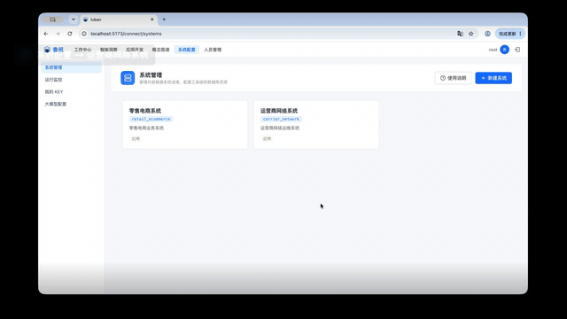
</p>

### 2. 索引重建与问数

重建 Embedding 与 FAISS 索引后，用自然语言提问，Agent 基于本体概念逐层下钻。

<p align="center">
  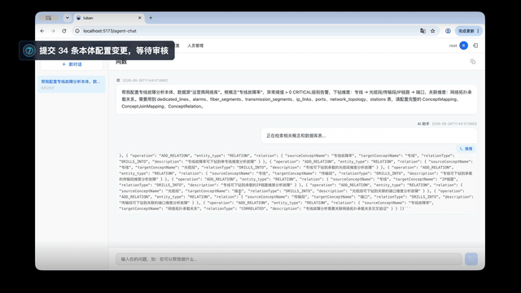
</p>

### 3. 根因下钻与证据链

多轮下钻后定位根因，输出结论 + 证据链 + 概念命中，推理链路完整可追溯。

<p align="center">
  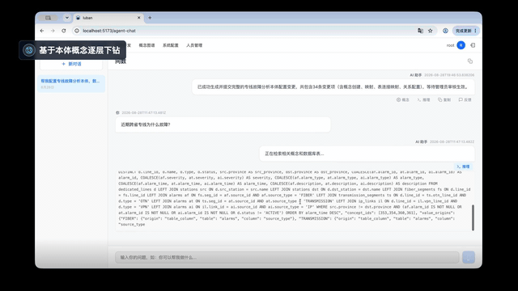
</p>

---

## 界面截图

### 智能洞察

NL2SQL 自然语言查询，输入问题自动生成 SQL 并返回结果，支持知识图谱辅助归因分析。

<p align="center">
  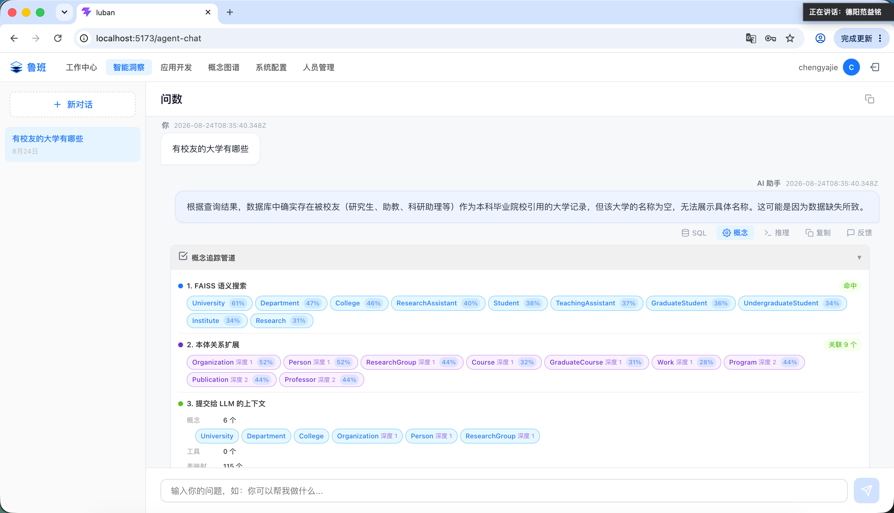
</p>

### 概念管理

本体概念编辑器，支持概念树浏览、关系图谱可视化、概念 CRUD 和批量导入。

<p align="center">
  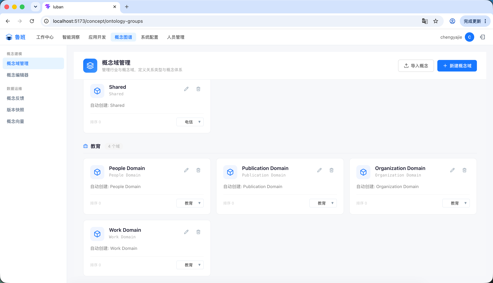
</p>

### 概念编辑

概念详情编辑，支持属性配置、关系定义、同义词管理和 FAISS 向量索引。

<p align="center">
  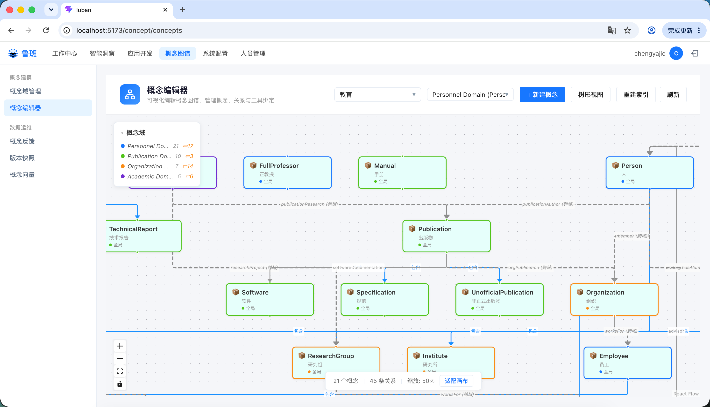
</p>

### 概念导入

支持从 Excel/OWL 批量导入本体概念，自动解析层级关系和属性映射。

<p align="center">
  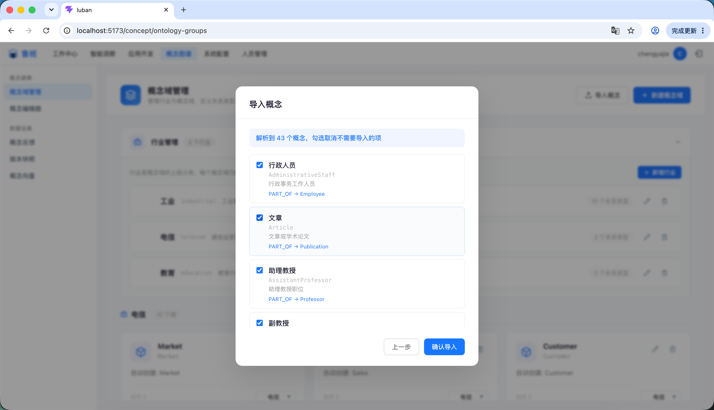
</p>

### 概念权限

角色维度控制概念域的查询权限，支持角色-域-行业三层权限体系。

<p align="center">
  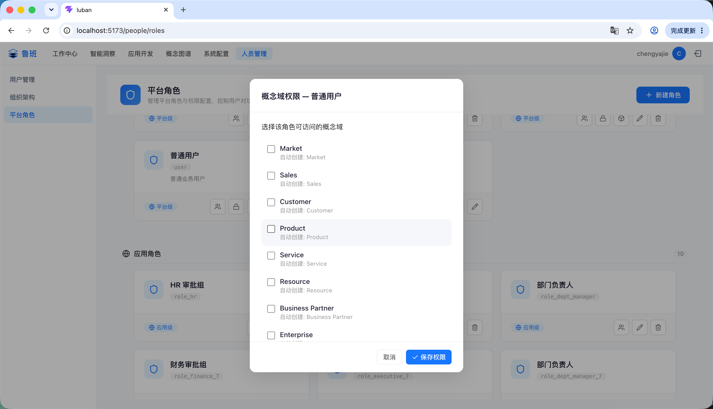
</p>

### 异步任务

异步任务管理中心，查看概念导入、向量索引等后台任务的进度和日志。

<p align="center">
  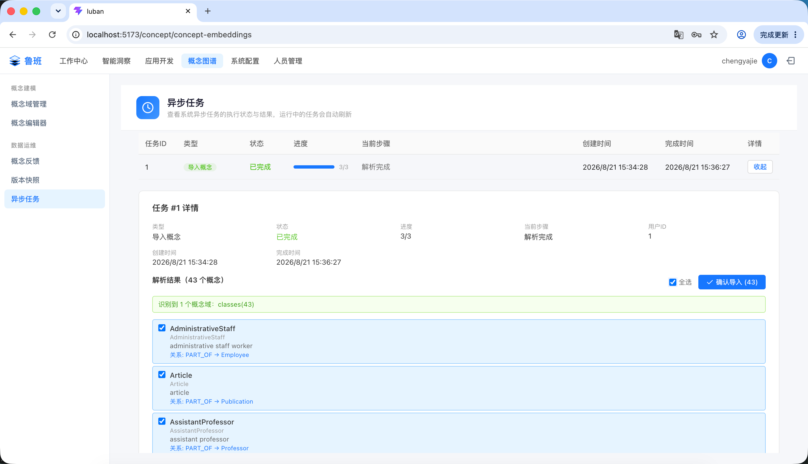
</p>

### 数据连接

管理数据库连接和 API 数据源，支持 MySQL 直连查询，为 SQL 执行和概念映射提供数据基础。

<p align="center">
  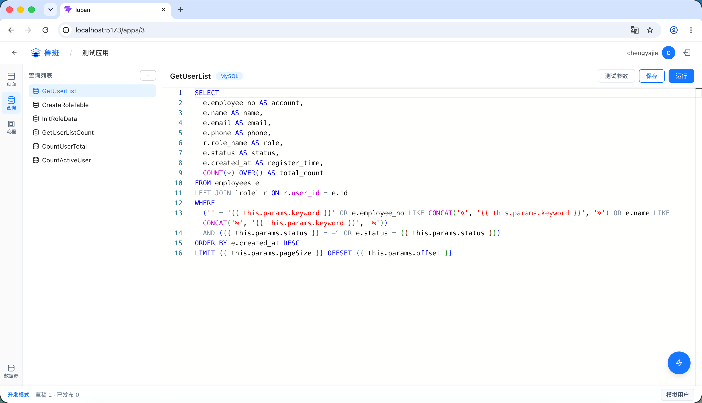
</p>

### 开发助手

内置 AI Agent 对话面板，支持自然语言驱动开发：建表、配数据源、生成页面、设计流程，全程 AI 陪伴。

<p align="center">
  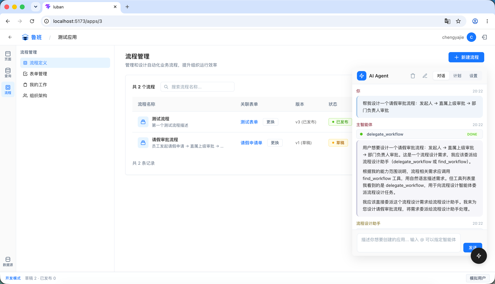
</p>

### 页面设计

所见即所得的可视化页面构建器，支持 AI 生成 HTML/CSS/JS 页面，实时预览，支持自定义代码编辑。

<p align="center">
  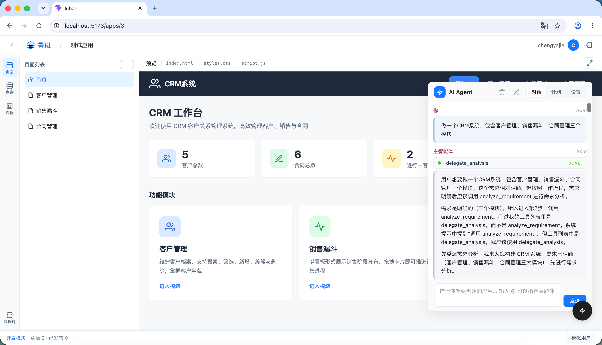
</p>

### 流程设计

拖拽式流程设计器，支持审批流程、条件分支、并行节点，内置 ProcessEngine 状态机驱动流程运转。

<p align="center">
  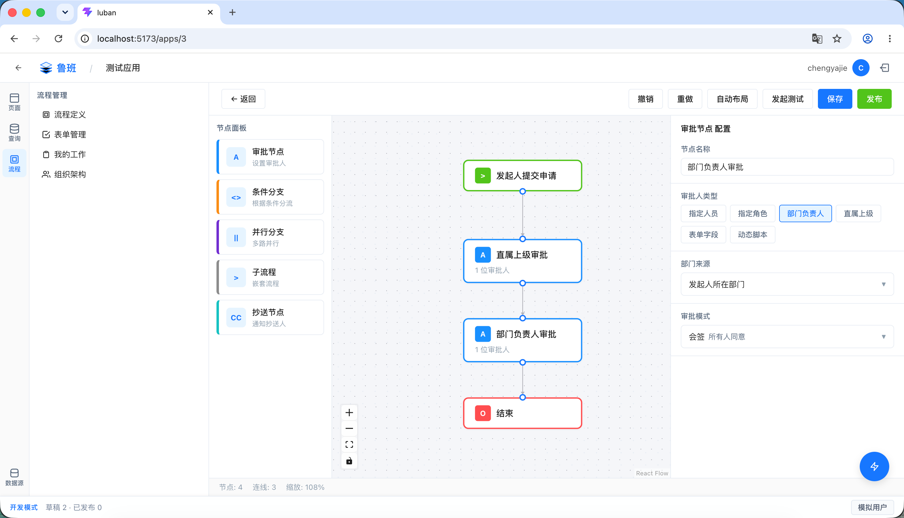
</p>

### 我的工作

个人工作台，查看待办审批、流程实例、任务进度。

<p align="center">
  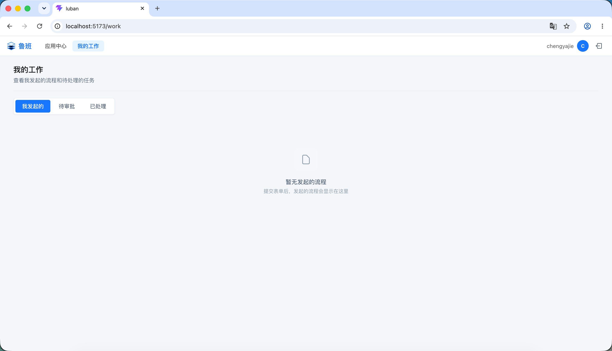
</p>

### 应用中心

统一管理所有应用，支持创建、切换和组织应用。

<p align="center">
  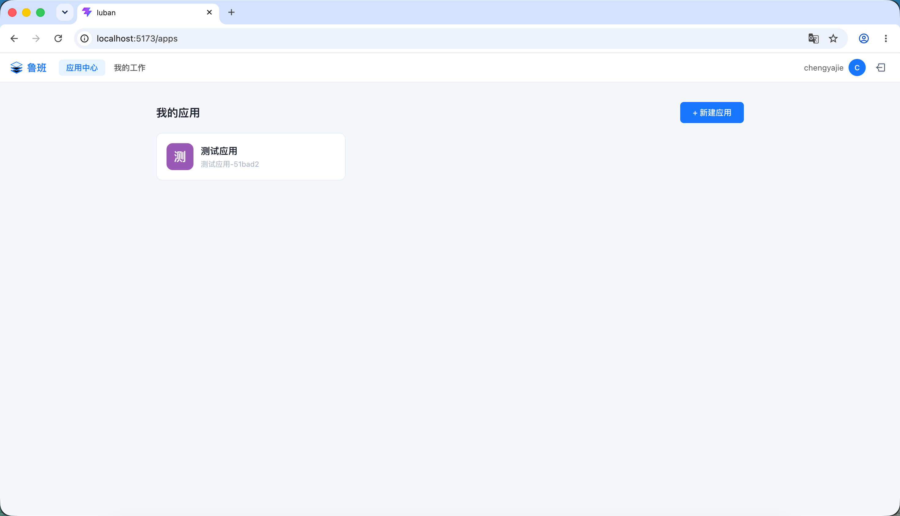
</p>

---

## 简介

**鲁班（Luban）** 的核心是**概念本体建模 + 自然语言问数**。企业先建知识图谱（定义"销售额""退货率"等概念的本体关系），然后用自然语言直接查数据——AI 通过知识图谱理解语义，自动生成 SQL，结果精准可控。同时提供 VibeCoding 开发能力：

```
你说"帮我查上个月华东区退货率"     → AI 结合知识图谱生成 SQL，返回结果    （问数 · 核心）
你说"把退货率做个趋势图放首页"     → AI 生成页面，绑定真实数据            （开发）
你说"退货率超过 5% 自动发起审批"   → AI 生成流程，关联组织架构            （自动化）
```

| 环节 | 定位 | 能力 |
|------|------|------|
| 🔍 **问数** | ⭐ 核心 | 知识图谱推理、本体概念管理、NL2SQL 自然语言查询 |
| 🔌 **连接** | 基础 | 外部系统接入、API Key 权限管理 |
| 🛠️ **开发** | 扩展 | VibeCoding 页面生成、流程引擎、多智能体协作 |

### 功能模块

| 模块 | 路径 | 说明 |
|------|------|------|
| 应用中心 | `/apps` | 创建和管理应用，每个应用独立的数据和 Agent 上下文 |
| 智能洞察 | `/agent-chat` | AI Agent 对话 + NL2SQL 自然语言查询，ReAct + Plan-Execute 双模式 |
| 概念图谱 | `/concept` | 概念域管理、概念编辑器、概念反馈、版本快照、异步任务 |
| 系统配置 | `/connect` | 系统管理、运行监控、API Key 管理、大模型配置 |
| 人员管理 | `/people` | 用户管理、组织架构、平台角色 |
| 工作中心 | `/work` | 我的工作台、平台审核 |

### 为什么选择鲁班？

适合**拥有多个业务系统、希望用 AI 提升数据利用效率**的中大型企业。典型场景：ERP、MES、CRM 等系统数据分散，业务人员查数依赖 IT 写 SQL，数字化需求排期长、交付慢。

**ChatBI 为什么不够？**

ChatBI 解决了"查"的问题，但企业真正需要的是"查完能做事"——查出退货率异常，要有人审批；查出库存不足，要触发补货流程；查出销售趋势，要生成日报看板。ChatBI 是终点，鲁班把它变成起点。

**鲁班 = 企业知识图谱 + VibeCoding**

| 维度 | 纯 VibeCoding 工具（Bolt / v0 / Cursor） | 纯 ChatBI | 鲁班 |
|------|------|------|------|
| 面向用户 | 开发者 | 业务人员 | 业务人员 + IT |
| 核心能力 | 自然语言生成前端代码 | 自然语言翻译 SQL | 知识图谱驱动的精准问数，VibeCoding 一体 |
| 数据感知 | 无，生成的页面是静态 Demo | 有，但只能用自然语言翻译 SQL | 概念本体建模，AI 理解企业数据语义 |
| 产出物 | 代码片段 / 静态页面 | 查询结果 | 可运行的企业应用（页面 + 数据 + 流程） |
| 企业适配 | 需要开发者二次加工 | 需要 BI 团队建模型 | 开箱即用，私有化部署 |

**核心痛点 → 鲁班解法**：

| 痛点 | 现状 | 鲁班怎么做 |
|------|------|-----------|
| 数据孤岛，术语混乱 | "销售额"在 ERP 叫 `total_amount`，在 CRM 叫 `revenue`，业务人员搞不清 | 构建**概念本体**，将不同系统的字段映射到统一概念，AI 自动识别 |
| 查完数据没法做事 | 查出退货率异常，然后呢？截图发群里等响应 | **VibeCoding 闭环**：查数 → 一句话生成监控看板 → 一句话生成异常审批流 |
| 数字化需求多，开发跟不上 | 做个审批流要前后端各一人，两周起步 | **AI Agent 驱动开发**，自然语言描述需求，生成即运行 |
| 大模型 API Key 安全焦虑 | 担心 Key 上传到服务端被泄露 | 开发 Agent 在**浏览器端运行**，Key 存 IndexedDB Vault，服务端完全不接触 |
| 权限管控粗放 | 要么全看，要么全不看 | **三层权限体系**：平台页面权限 + 问数概念域权限 + API Key 工具/数据源权限 |

**适应行业与场景**：

> 2024 年中国商业智能与分析软件市场规模达 10.6 亿美元，生成式 AI 与 BI 深度融合是核心增长驱动力。2025-2026 年 ChatBI 进入规模化落地拐点，但调研显示 300 家规模以上企业 ChatBI 上线 3 个月后周均使用率不足 15%——核心瓶颈不是 AI 能力，而是**数据语义混乱**和**权限管控缺失**。鲁班通过概念本体 + 三层权限直击这两个痛点。

| 行业 | 典型场景 | 为什么适合鲁班 |
|------|---------|---------------|
| **制造业** | 生产日报查询（产量/良率/OEE）、供应链库存分析、质检数据追溯 | 系统多（ERP+MES+WMS），术语不统一，"良率"在 MES 叫 `yield_rate`，在 ERP 叫 `quality_ratio`——概念本体统一语义，业务人员用自然语言直接查 |
| **零售/电商** | 销售分析（日/周/月趋势、同店对比）、库存周转、客户复购分析 | 业务人员占比高、IT 资源少，每天大量临时取数需求。实际案例：某零售企业用 NL2SQL 处理 6 表关联查询，SQL 精准度从 89% 提升到 97% |
| **金融** | 风控报表查询、监管报送数据提取、客户资产分析 | 数据敏感度高，私有化部署刚需；业务部门查询需求量大但 IT 排期按周算。三层权限确保不同角色只能看授权域的数据 |
| **物流/供应链** | 运输时效分析、仓储利用率、配送异常追溯 | 运营密集型，每天产生大量结构化数据，管理层需要实时了解 KPI 但不会写 SQL |
| **能源/物联网** | 设备运行监控、能耗分析、故障预测查询 | 设备参数语义混乱（同一传感器在不同系统命名不同），概念本体统一建模，消除歧义 |

**关键市场数据**：

- 自然语言处理企业应用市场中，银行与金融、零售与电子商务、制造业、能源、物流是前五大垂直行业
- 主流 BI 厂商（瓴羊 Quick BI、Smartbi、观远数据等）已将 ChatBI 作为标配功能，但 80% 企业的 ChatBI 沦为"演示工具"——核心原因是缺乏本体建模和数据治理，查询准确率低；且 ChatBI 只能"查"，企业需要的是"查完能做事"
- VibeCoding 工具（Bolt.new、v0.dev、Cursor、Lovable）在 2024-2025 年爆发式增长，但它们面向的是**开发者**，产出的是静态页面或代码片段，不感知企业数据语义，无法直接产生业务价值
- 鲁班的差异化：**将概念本体建模范式内置到产品中**，让企业从"建 BI 报表"升级为"建知识图谱 + 自然语言问数"。同时提供 VibeCoding 开发能力——问完数，一句话生成看板和流程。

**与竞品的差异**：

| 维度 | 传统 BI（帆软/Tableau） | 低代码平台（简道云/明道云） | VibeCoding 工具（Bolt/v0） | 鲁班 |
|------|------------------------|---------------------------|------|------|
| 查数方式 | 拖拽配置，需要培训 | 预设模板，灵活度有限 | 不支持 | 自然语言对话，零门槛 |
| 应用开发 | 不支持 | 表单驱动，场景固定 | 自然语言生成代码 | 自然语言生成可运行应用 |
| 数据语义 | 物理表名，技术视角 | 字段别名，单表映射 | 无数据感知 | 本体概念图，跨系统推理 |
| 产出物 | 报表 | 表单/流程 | 代码片段/静态页面 | 数据看板 + 审批流 + 业务页面 |
| 部署方式 | SaaS 或私有化 | SaaS | SaaS | 私有化部署，数据不出企业 |
| 从问到做 | 问完截屏 | 单独配置 | 无法闭环 | 查数 → 看板 → 流程，全闭环 |

---

## 下一步计划

### 一、自动洞察（查数 → 懂数）

**目标**：NL2SQL 从单次查询升级为多轮推理链，AI 自动拆解问题、下钻维度、定位根因。

**场景**：用户问"上个月退货率为什么涨了"，AI 自动完成——趋势确认 → 按产品线拆解 → 按地区拆解 → 按批次拆解 → 定位根因并给出建议。

**实现路径**：

```
Phase 1：单轮稳定（当前已完成）
  NL2SQL 单次查询准确率稳定在可用水平，概念本体覆盖核心业务域

Phase 2：维度下钻引擎
  · 本体中补充维度关系（产品→地区→批次→供应商，定义下钻路径）
  · LLM 根据问题自动选择下钻维度，生成多轮查询计划
  · 每轮查询结果注入下一轮推理上下文

Phase 3：根因输出
  · LLM 汇总多轮查询结果，生成自然语言根因报告
  · 异常阈值可配置，超出阈值自动触发下钻
  · 如有配置算法，可选调用算法做更精确的因果推断
```

**验证方法**：准备 5 个真实业务场景的根因分析问题（如"华东区退货率异常""某产品线产能下降"），每个场景预设已知根因。验证 AI 能否在 3 轮以内定位到正确根因，准确率目标 ≥ 80%。

---

### 二、企业知识库 + RAG（本体驱动的非结构化检索）

**目标**：本体不只管结构化数据（SQL），还能索引非结构化数据（文档、手册、邮件），实现"查数据库 + 查文档"的统一问答。

**场景**：用户问"A 产品的退货标准是什么"，AI 同时查知识图谱（找到 A 产品概念）和文档库（检索退货标准 SOP），融合回答："A 产品退货标准：外观瑕疵可退、已拆封不可退。上月退货率 3.2%，低于 5% 阈值。"

**为什么不过时**：传统 RAG 是"关键词 → 向量 → 召回"，缺乏语义结构。本体驱动的 RAG 是"概念 → 关联概念 → 多路召回"——用户问"退货标准"，本体知道"退货"关联"RMA 流程""质检规范""供应商罚则"，自动扩展检索范围，召回率和准确率远高于普通 RAG。

**实现路径**：

```
Phase 1：文档索引
  · 企业上传文档（PDF/Word/Markdown），自动分块、向量化
  · 文档与概念本体关联（标注"本文档描述退货标准，关联概念：退货率、RMA"）

Phase 2：混合检索
  · 用户提问 → 本体识别概念 → 同时查询结构化数据（SQL）和非结构化数据（向量检索）
  · LLM 融合两种结果，区分"数据答案"和"知识答案"

Phase 3：知识图谱增强
  · 从文档中自动抽取实体和关系，补充到本体
  · 文档更新时自动触发向量索引重建
```

**验证方法**：准备 10 个需同时查数据库和文档才能回答的问题，验证 AI 能否正确融合两类信息源，融合准确率目标 ≥ 85%。

---

### 三、算法热加载（LLM + 企业算法编排）

**目标**：企业上传自己的算法（Python/Java），LLM 根据用户问题选择算法、喂数据、解释结果。先收敛到 1-2 个垂直场景验证模式，再考虑平台化。

**首发场景**：制造业智能排产——用户问"下周三号线接不接得了 5000 件订单"，LLM 调用排产算法，输入本体映射的产能/订单/交期数据，返回结果并解读。

**实现路径**：

```
Phase 1：算法注册（单场景：排产）
  · 定义算法接口规范：输入 schema（本体概念映射）、输出 schema（结构化结果）
  · 企业上传算法包（Python 脚本/Java JAR），平台校验接口合规性
  · 算法注册到本体——"排产算法"关联概念"产能""订单""交期""生产线"

Phase 2：LLM 编排
  · 用户提问 → LLM 识别意图 → 匹配算法 → 从本体取数据 → 喂入算法
  · 算法返回 → LLM 解读结果 → 自然语言输出
  · 算法失败时 LLM 降级为纯推理模式

Phase 3：扩展场景（验证模式后）
  · 需求预测、异常检测等场景，复用同一套算法注册和编排机制
  · 算法间支持链式调用（排产→预测→优化）
```

**验证方法**：找一个制造业客户的真实排产场景，用 3 个月的历史订单数据做回测。验证 AI + 算法的排产结果是否优于人工排产，核心指标：排产耗时（目标 ≤ 人工的 10%）、产能利用率（目标 ≥ 人工方案）。

---

## 技术栈

| 层级 | 技术 |
|------|------|
| **前端** | React 19 + TypeScript + Vite |
| **状态管理** | Zustand（持久化 + 应用级隔离） |
| **代码编辑器** | Monaco Editor |
| **流程图** | @xyflow/react (React Flow) |
| **AI Agent** | 纯浏览器端运行（ReAct + Plan-Execute，多智能体协作） |
| **后端** | Java 21 + Spring Boot 3.3.2 |
| **ORM** | Spring Data JPA + Hibernate |
| **知识图谱** | Apache Jena（本体推理） |
| **向量索引** | FAISS（概念相似度检索） |
| **数据库** | MySQL 8.0 |
| **认证** | Spring Security + JWT + API Key + 模拟用户过滤器 |

---

## AI Agent 架构

鲁班有两套独立的 Agent 系统：**开发 Agent** 在浏览器端运行，负责页面生成、流程设计、数据源配置等开发任务；**问数 Agent** 在后端运行，负责 NL2SQL 自然语言查数。

---

### 一、开发 Agent（前端 · 浏览器端运行）

**运行位置**：浏览器（纯前端）  
**关键代码**：[agentLoop.ts](file:///Users/chengyajie/Project/luban/frontend/src/agent/core/agentLoop.ts)、[agentRegistry.ts](file:///Users/chengyajie/Project/luban/frontend/src/agent/registry/agentRegistry.ts)

#### Agent 模式

| 模式 | 说明 | 适用场景 |
|------|------|----------|
| **ReAct** | 思考→行动→观察 循环推理，边想边做 | 页面生成、样式调整、Bug 修复 |
| **Plan-Execute** | 先制定完整计划，再逐步执行 | 复杂任务、多步骤操作 |

#### 多智能体协作

主智能体通过 `@` 提及或 `delegate:*` 技能将子任务委派给子智能体。ChatRouter 负责路由：识别用户输入中的 `@` 提及，切换到对应的子智能体，并注入其系统提示词和工具列表。

| ID | 名称 | 角色 | 技能数 | 典型技能 |
|----|------|------|:--:|------|
| `main-agent` | 主智能体 | 调度 + 开发 | 19 | `page:create`, `code:create`, `plan:create`, `delegate:*` |
| `analysis-assistant` | 需求分析助手 | 业务分析 | 7 | `plan:create`, `plan:update`, `plan:confirm` |
| `data-assistant` | 数据辅助智能体 | 数据源 + 查询 | 10 | `datasource:connect`, `query:create`, `query:run` |
| `workflow-assistant` | 流程设计助手 | 表单/流程/审批 | 15 | `workflow:design`, `workflow:approve`, `workflow:lint` |

#### Skill Registry（技能注册表）

工具能力从 Agent 中解耦为独立 Skill，Agent 通过 `allowedSkills` 数组声明可用技能，`resolveAgentTools()` 运行时解析。同一 Skill 可被多个 Agent 复用。

```
Skill Registry
  ├─ page:create / delete / rename               → 页面管理
  ├─ code:create / get / update                  → 代码生成
  ├─ plan:create / update / confirm / validate   → 计划管理
  ├─ datasource:list / test / structure / connect → 数据源操作
  ├─ query:list / create / update / delete / run → 查询操作
  ├─ workflow:design_form / design / approve / ... → 流程设计
  ├─ delegate:analysis / query / workflow        → 智能体委派
  └─ observation:list_pages / record             → 状态观察
```

#### 工作流程

```
需求澄清 → 需求分析 → 创建计划 → 用户确认 → 执行计划 → 验证完成
   │          │           │          │          │
   │    delegate:         分析助手    主智能体    主智能体
   │    analysis       plan:create plan:confirm  逐个执行步骤
   │                   plan:update plan:update_item
   │          │                      │
   │    分析助手输出：               ├─ delegate:query → 数据辅助智能体
   │    · 话题拆解                   ├─ delegate:workflow → 流程设计助手
   │    · UI 布局（ASCII 框图）       ├─ code:create → 页面生成
   │    · 数据字段（业务语言）         └─ plan:validate → 验证
   │    · Query 设计（输入/输出）
   │    · 流程分析（表单/审批）
   │    · 冲突合并
```

#### 智能体记忆隔离

| 隔离维度 | 机制 | 说明 |
|---------|------|------|
| 应用间隔离 | `Map<appId, Map<agentId, Message[]>>` | 切换应用后记忆自动清除 |
| 智能体间隔离 | `agentId` 作为 key | 子智能体记忆互不干扰 |
| 持久化存储 | localStorage（按 appId 隔离） | 主智能体对话历史刷新不丢失 |

#### 隐私与安全

- **API Key Vault 加密存储** — 大模型 API Key 使用 IndexedDB 加密存储（`vaultManager`），服务端永远无法获取
- **对话数据应用隔离** — chat 记录按 `appId` 隔离，存储在 localStorage，切换应用自动切换上下文
- **直连大模型** — 请求从浏览器直接发送到大模型 API，不经服务端中转，无中间人风险
- **支持多 Provider** — 可配置 OpenAI、Anthropic、Google Gemini、DeepSeek 或任意兼容 OpenAI API 格式的端点

#### 配置大模型

在应用编辑页右上角点击 ⚙️ 设置图标，填入你的大模型配置：

| 配置项 | 说明 | 示例 |
|--------|------|------|
| 提供商 | 大模型服务商 | DeepSeek / OpenAI / Anthropic / Google Gemini / 自定义 |
| API 地址 | 兼容 OpenAI 格式的 API 端点 | `https://api.deepseek.com/v1` |
| API Key | 你的大模型 API Key | `sk-xxxxxxxx` |
| 模型名称 | 模型 ID | `deepseek-chat` |

---

### 二、问数 Agent（后端 · Java）

**运行位置**：服务端（Spring Boot）  
**关键代码**：[AgentService.java](file:///Users/chengyajie/Project/luban/backend/src/main/java/com/luban/service/AgentService.java)  
**API 入口**：`POST /api/v1/agent/chat`（JWT 认证）

#### 架构

问数 Agent 通过 **ReAct 图**（StateGraph）将 LLM 推理、概念检索、NL2SQL 执行编排到一起：

```
┌──────────┐      ┌──────────────────┐      ┌──────────────┐
│  agent   │ ──→  │  tool_executor   │ ──→  │    agent     │ ◄── 循环
│ (LLM)    │      │  (HTTP 工具调用)  │      │  (继续推理)  │
└──────────┘      └──────────────────┘      └──────────────┘
     │
     ├──→  nl2sql_executor  ──→  agent  ◄── 循环（最多 3 次重试）
     │     (SQL 生成 + 执行)
     │
     └──→  final_answer  ──→  END
```

#### 核心流程

```
用户提问 "上个月华东区销售额是多少？"
    │
    ▼
┌─────────────────────────────────────────────────────┐
│ 1. 概念检索（buildUnifiedContext）                     │
│    · FAISS 向量检索：找到 "销售额"、"华东区" 相关概念      │
│    · 本体关联：展开概念的本体关系（上/下位、同义、关联）      │
│    · 组装为统一提示词，注入 LLM 系统提示                    │
└─────────────────────────────────────────────────────┘
    │
    ▼
┌─────────────────────────────────────────────────────┐
│ 2. LLM 推理（agent 节点）                              │
│    · 分析用户问题，结合概念列表决定下一步                  │
│    · 如果可以直接回答 → final_answer                   │
│    · 如果需要调用工具 → tool_call                      │
│    · 如果涉及数据查询 → nl2sql（生成 SQL + concept_ids）  │
└─────────────────────────────────────────────────────┘
    │
    ▼
┌─────────────────────────────────────────────────────┐
│ 3. NL2SQL 执行（nl2sql_executor 节点）                 │
│    · 权限校验：roleConceptPermissionService 检查用户     │
│      对 SQL 涉及的概念域是否有查询权限                    │
│    · SQL 安全校验：表名白名单、关键字过滤                  │
│    · 执行 SQL → 失败则回传错误给 LLM 重试（最多 3 次）     │
│    · 授权错误不重试，直接提示用户申请权限                   │
└─────────────────────────────────────────────────────┘
    │
    ▼
┌─────────────────────────────────────────────────────┐
│ 4. 最终回答（final_answer 节点）                        │
│    · 返回自然语言答案 + 概念溯源（conceptTrace）          │
│    · 记录指标：耗时、LLM 调用次数、概念命中数、SQL 执行结果  │
└─────────────────────────────────────────────────────┘
```

#### 会话管理

- 会话历史存储在 `ConcurrentHashMap<String, List<Map>>`（内存），同时持久化到 `chat_message` 表
- 每次请求从 DB 加载历史，追加用户消息后送入 LLM
- 限流：每个 session 每分钟最多 20 次请求
- 空闲会话 30 分钟自动清理

#### 概念溯源

问数 Agent 在返回答案的同时，会附带 `conceptTrace`——记录每一步用到的概念来源：

| 溯源节点 | 说明 |
|---------|------|
| `faiss_match` | FAISS 向量检索命中的概念及置信度 |
| `ontology_expand` | 本体关联展开的概念及深度 |
| `llm_context` | 提交给 LLM 的完整概念列表 |
| `used_concepts` | LLM 最终选择使用的概念 |

前端反馈工作台可查看每次问数的概念溯源，详见 [概念反馈](#概念反馈)。

---

## 项目结构

```
luban/
├── backend/                        # Spring Boot 后端
│   ├── src/main/java/com/luban/
│   │   ├── config/                 # 安全配置、CORS、拦截器
│   │   ├── controller/             # REST API 控制器
│   │   │   ├── AgentConfigController.java    # Agent 配置管理
│   │   │   ├── AgentController.java          # Agent 对话接口
│   │   │   ├── ApiKeyController.java         # API Key 管理
│   │   │   ├── ApplicationController.java    # 应用管理
│   │   │   ├── AuthController.java           # 认证（登录/注册/退出）
│   │   │   ├── ConceptController.java        # 概念 CRUD + 树形结构
│   │   │   ├── ConceptEmbeddingController.java # 概念向量索引
│   │   │   ├── ConceptFeedbackController.java # 概念反馈（点赞/点踩）
│   │   │   ├── ConceptImportController.java  # 概念批量导入
│   │   │   ├── ConceptSnapshotController.java # 概念变更审计
│   │   │   ├── DatasourceController.java     # 数据源管理
│   │   │   ├── IndustryController.java       # 行业管理
│   │   │   ├── McpGatewayController.java     # 外部 Agent 入口（HTTP JSON-RPC）
│   │   │   ├── McpInternalController.java    # 内部 Agent 工具调用
│   │   │   ├── Nl2SqlController.java         # NL2SQL 自然语言查询
│   │   │   ├── OntologyGroupController.java  # 概念域管理
│   │   │   ├── PageController.java           # 页面管理
│   │   │   ├── QueryController.java          # 查询管理
│   │   │   ├── SwaggerImportController.java  # Swagger 批量导入工具
│   │   │   ├── SystemPermissionController.java # 系统权限管理
│   │   │   ├── ToolController.java           # 工具管理（HTTP 透传）
│   │   │   ├── ToolDefinitionController.java # 工具定义
│   │   │   └── UserController.java           # 用户管理
│   │   ├── dto/                    # 请求/响应 DTO
│   │   ├── entity/                 # JPA 实体
│   │   ├── embedding/              # FAISS 向量索引客户端
│   │   ├── mcp/                    # 网关协议实现（Session/路由/连接管理）
│   │   ├── repository/             # 数据访问层
│   │   ├── security/               # JWT + API Key + 模拟用户过滤器
│   │   │   ├── JwtAuthFilter.java
│   │   │   ├── JwtTokenProvider.java
│   │   │   ├── ApiKeyAuthFilter.java
│   │   │   └── ImpersonationFilter.java
│   │   ├── service/                # 业务逻辑层
│   │   │   ├── AgentService.java           # Agent 推理执行
│   │   │   ├── ConceptService.java         # 概念管理
│   │   │   ├── ConceptEmbeddingService.java # 向量索引服务
│   │   │   ├── ConceptFeedbackService.java # 概念反馈
│   │   │   ├── ConceptImportService.java   # 概念导入
│   │   │   ├── ConceptSnapshotService.java # 变更审计
│   │   │   ├── FaissService.java           # FAISS 向量检索
│   │   │   ├── Nl2sqlConnectionPool.java   # NL2SQL 连接池
│   │   │   ├── OntologyService.java        # Jena 本体推理
│   │   │   ├── RoleConceptPermissionService.java # 概念权限
│   │   │   ├── SqlGeneratorService.java    # SQL 自动生成
│   │   │   └── SqlSecurityValidator.java   # SQL 安全校验
│   │   ├── util/                   # 工具类（AES 加密、Ed25519 签名、AgentLogger）
│   │   └── workflow/               # 流程引擎模块
│   │       ├── controller/         # 流程 API（表单/流程/实例/任务/成员/部门/角色/管理/校验/Excel/绑定/同步）
│   │       ├── entity/             # 流程实体
│   │       ├── repository/         # 流程数据访问层
│   │       └── service/            # 流程引擎（ProcessEngine 状态机）
│   └── src/main/resources/
│       ├── application.yml         # 应用配置
│       └── db/migration/           # Flyway 迁移脚本
├── frontend/                       # React + Vite 前端
│   └── src/
│       ├── agent/                  # AI Agent 核心（纯浏览器端）
│       │   ├── core/               # Agent 引擎
│       │   │   ├── AgentFactory.ts  # Agent 工厂（创建 + 执行）
│       │   │   ├── agentLoop.ts     # ReAct 循环（推理→行动→观察）
│       │   │   ├── chatRouter.ts    # 多智能体路由（Mention 识别 + 委派 + 记忆管理）
│       │   │   ├── llmClient.ts     # LLM API 调用（流式 + Function Calling）
│       │   │   ├── memoryManager.ts # IndexedDB 对话持久化
│       │   │   ├── planContext.ts   # 计划上下文管理
│       │   │   └── vaultManager.ts  # API Key 加密存储（IndexedDB Vault）
│       │   ├── llm/                # LLM 流式解析
│       │   ├── prompts/            # 系统提示词
│       │   │   ├── systemPrompt.ts  # 主智能体提示词
│       │   │   ├── dbaPrompt.ts     # 数据辅助智能体提示词
│       │   │   ├── workflowAgent.ts # 流程设计助手提示词
│       │   │   └── analysisAgent.ts # 需求分析助手提示词
│       │   ├── registry/           # 注册表
│       │   │   ├── agentRegistry.ts # Agent 定义
│       │   │   ├── skillRegistry.ts # Skill 注册表（解耦 Agent 与工具）
│       │   │   ├── agentMemory.ts   # 智能体记忆缓存（应用级隔离）
│       │   │   └── skills/          # 技能实现（page/code/plan/datasource/query/workflow/delegate/observation）
│       │   └── config.ts           # Agent 配置
│       ├── api/                    # API 请求封装
│       │   ├── agent.ts            # Agent 对话
│       │   ├── auth.ts             # 认证
│       │   ├── concept.ts          # 概念 + 反馈 + 快照 + 嵌入
│       │   ├── datasource.ts       # 数据源
│       │   ├── mcp.ts              # 网关 + 工具
│       │   ├── ontology.ts         # 本体域 + 行业
│       │   ├── permission.ts       # 权限管理
│       │   ├── query.ts            # 查询管理
│       │   ├── snapshot.ts         # 变更审计
│       │   ├── user.ts             # 用户管理
│       │   ├── workflow.ts         # 流程 API
│       │   └── client.ts           # Axios 实例（拦截器 + JWT）
│       ├── components/             # 公共组件
│       │   ├── AgentPanel/         # AI Agent 对话面板
│       │   ├── ConceptTracePanel.tsx # 概念追溯面板
│       │   ├── DataTable/          # 通用数据表格
│       │   ├── PageTopbar.tsx      # 页面顶栏
│       │   ├── SearchBox/          # 搜索框
│       │   ├── Select/             # 通用下拉选择器
│       │   ├── DevToolbar/         # 开发工具栏（模拟用户）
│       │   ├── InteliEditor/       # Monaco 代码编辑器
│       │   ├── InteliPreview/      # iframe 实时预览
│       │   ├── ResizablePanel/     # 可调整面板
│       │   ├── ConfirmDialog/      # 确认对话框
│       │   └── Toast/              # Toast 通知
│       ├── pages/                  # 页面组件
│       │   ├── AgentChatPage.tsx       # 智能洞察（AI 对话 + NL2SQL）
│       │   ├── AgentConfigPage.tsx     # 大模型配置
│       │   ├── ApiKeyPage.tsx          # API Key 管理
│       │   ├── ConceptEditorPage.tsx   # 概念编辑器
│       │   ├── ConceptEmbeddingPage.tsx # 异步任务（向量索引）
│       │   ├── ConceptFeedbackPage.tsx # 概念反馈工作台
│       │   ├── ConceptSnapshotPage.tsx # 版本快照
│       │   ├── GatewayPage.tsx         # 运行监控（Agent 指标）
│       │   ├── OntologyGroupPage.tsx   # 概念域管理
│       │   ├── OrgPage.tsx             # 组织架构
│       │   ├── RoleManagementPage.tsx  # 平台角色
│       │   ├── SystemListPage.tsx      # 系统管理
│       │   ├── ToolListPage.tsx        # 工具管理
│       │   ├── UserListPage.tsx        # 用户管理
│       │   ├── WorkApprovalPage.tsx    # 平台审核
│       │   └── workflow/               # 流程模块（设计器/查看器/表单/实例/任务）
│       ├── stores/                  # Zustand 状态管理
│       │   ├── authStore.ts         # 认证状态
│       │   ├── applicationStore.ts  # 应用列表
│       │   ├── agentStore.ts        # Agent 对话（应用级隔离 + 持久化）
│       │   ├── llmStore.ts          # LLM 配置（Vault 加密）
│       │   ├── impersonationStore.ts # 模拟用户
│       │   ├── permissionStore.ts   # 权限状态
│       │   ├── toastStore.ts        # Toast 通知
│       │   ├── confirmStore.ts      # 确认对话框
│       │   └── loadingStore.ts      # 全局加载
│       ├── types/                   # TypeScript 类型定义
│       ├── router/                  # 路由配置 + 权限守卫
│       └── hooks/                   # 自定义 Hooks
├── docker-compose.yml               # MySQL 容器
└── doc/                             # 需求文档 + 图片 + 本体文件
```

---

## 核心数据模型

### User 与 Member 的关系

```
members（超集：组织通讯录）
  │
  ├── 有 userId → 正式用户 ──→ users（子集：登录账号）
  │     └── 可登录、可被分配任务、可审批
  │
  └── 无 userId → 测试用户
        └── 仅用于流程模拟，不可登录
```

| 表 | 用途 | 类比 |
|----|------|------|
| **users** | 登录认证（邮箱、密码、JWT） | 门禁卡 |
| **members** | 组织信息（姓名、部门、职位、工号、上级） | 公司花名册 |

**关键规则：**

- 用户注册时自动同步创建 Member
- Member 是超集：包含正式用户（有 userId）和测试用户（userId = NULL）
- 每个 User 对应唯一一个 Member，一对一
- 流程设计器选人从 `members` 表读，DevToolbar 模拟用户也从 `members` 表读
- 测试用户不可登录，仅通过 DevToolbar 模拟使用

### 模拟用户（Impersonation）

DevToolbar 开发工具栏支持模拟任意用户身份，用于测试流程审批：

- 后端 `ImpersonationFilter` 过滤器拦截请求，检测 `X-Impersonate-User-Id` 请求头
- 前端 `impersonationStore` 管理模拟状态，axios 拦截器自动注入请求头
- 模拟用户信息存储在 `localStorage`，刷新不丢失
- 切换用户后自动 `bump` 版本号，触发全局数据刷新

---

## 权限体系

鲁班的权限分为三个独立维度，覆盖平台、问数、开发三种场景。

### 一、平台权限（角色 → 功能页面）

通过角色控制用户能看到哪些页面，存储在 `role_permissions` 表：

| 权限分组 | 权限 Key | 对应页面 |
|---------|---------|---------|
| 工作中心 | `workbench:read` | 我的工作、平台审核 |
| 问数 | `ask:read` | 智能洞察（AI 对话） |
| 应用开发 | `apps:read` | 应用中心、流程设计 |
| 人员管理 | `people:users` | 用户管理 |
| | `people:org` | 组织架构 |
| | `people:roles` | 平台角色（创建/编辑角色及权限） |
| 概念图谱 | `connect:concepts` | 概念编辑器 |
| | `connect:ontology-groups` | 概念域管理 |
| | `connect:concept-feedback` | 概念反馈 |
| | `connect:concept-snapshots` | 版本快照 |
| | `connect:concept-embeddings` | 异步任务 |
| 系统配置 | `connect:systems` | 系统管理 |
| | `connect:gateway` | 运行监控 |
| | `connect:keys` | 我的 KEY |
| | `connect:agent` | 大模型配置 |

**校验链路**：

```
用户登录 → 查 role_users 表获取角色列表
         → 查 role_permissions 表获取权限 Key 集合
         → 前端 GlobalHeader 根据权限 Key 显示/隐藏导航菜单
         → 前端 PermissionGate 拦截未授权路由，重定向到 /apps
```

### 二、问数权限（角色 → 概念域）

控制用户能否查询某个概念域下的数据，详见下方 [本体权限体系](#本体权限体系角色--域--行业)。

### 三、API Key 权限（Key → 工具/数据源）

外部 Agent 通过 API Key 调用鲁班工具时，需要单独申请工具和数据源的使用权限。权限审批走流程引擎。

**核心表**：

| 表 | 说明 |
|---|------|
| `api_key_tools` | API Key 可调用哪些工具（PENDING → APPROVED/REJECTED） |
| `api_key_datasources` | API Key 可访问哪些数据源（PENDING → APPROVED/REJECTED） |

**校验链路**：

```
外部 Agent 请求 → 网关提取 API Key → validateAndGetKey() 校验 Key 有效性
                                          → hasToolPermission() 校验工具权限
                                          → hasDatasourcePermission() 校验数据源权限
                                          → 任一未授权 → 拒绝请求
```

**审批流程**：

```
用户申请工具权限 → 创建 api_key_tools 记录（status=PENDING）
                → 自动发起「工具权限审批」流程（流程引擎）
                → 管理员审批 → APPROVED / REJECTED

用户申请数据源权限 → 创建 api_key_datasources 记录（status=PENDING）
                  → 自动发起「数据源权限审批」流程（流程引擎）
                  → 管理员审批 → APPROVED / REJECTED
```

**关键代码**：[ApiKeyService.java](file:///Users/chengyajie/Project/luban/backend/src/main/java/com/luban/service/ApiKeyService.java)

---

## 本体权限体系：角色 → 域 → 行业

### 核心链路

```
┌──────────┐    ┌───────────────────────┐    ┌──────────────┐    ┌──────────────┐
│  用户     │    │ role_concept_permission│    │ ontology_group│    │   industry   │
│  user_id │───→│ role_id              │───→│ group_id      │───→│ industry_id  │
│          │    │ group_id             │    │ industry_id   │    │ name         │
│  role_id │    └───────────────────────┘    └──────────────┘    └──────────────┘
└──────────┘                                                          │
                                                            ┌───────────┘
                                                            ↓
                                                  ┌──────────────────────┐
                                                  │  industry_relation    │
                                                  │  relation_type        │
                                                  │  is_transitive ←── 控制 Jena 推理
                                                  │  is_symmetric  ←── 控制 Jena 推理
                                                  └──────────────────────┘
```

### 两层含义

| 层级 | 用途 | 触发时机 |
|------|------|:--:|
| **角色 → 域** | 问数权限：用户能否查该域的概念 | 每次 NL2SQL 请求 |
| **域 → 行业** | 推理规则：该行业的关系类型是否具备传递性/对称性 | Jena 模型构建时 |

### 问数权限校验（自动）

```
用户问"本月产量"
       → NL2SQL 识别概念「产量」→ concept_id → group_id →「生产域」
       → 查 role_users 表获取用户角色列表
       → 查 role_concept_permissions 表：用户角色是否包含「生产域」的授权？
       → 是 → 生成 SQL → SQL 安全校验（仅允许 SELECT）→ 执行
       → 否 → 拒绝，提示"权限不足：以下概念未授权 —— 产量"
       → 概念无 groupId（公共概念）→ 直接放行
```

**关键代码**：[RoleConceptPermissionService.java](file:///Users/chengyajie/Project/luban/backend/src/main/java/com/luban/service/RoleConceptPermissionService.java)

### Jena 推理规则（自动）

```
问数时 → expandByConcepts() 展开概念
       → 对每个概念，resolveIndustryId(groupId)
       → 域.industryId → 行业
       → 找到该行业对应的 Jena OntModel
       → 该 Model 中的 Property 已按 industry_relation 表的
         isTransitive / isSymmetric 配置了推理规则
       → 推理引擎自动推导子概念和传递关系
```

**关键代码**：[OntologyService.java](file:///Users/chengyajie/Project/luban/backend/src/main/java/com/luban/service/OntologyService.java)

### 设计原则

- **权限只到域**：不问行业，角色授权域→域下所有概念自动可用
- **行业只管推理**：行业只控制 Jena 的 transitivity 规则和 LLM 的关系类型白名单
- **自动推导**：用户 → 角色 → 域 → 行业，整条链路对用户透明，无需手动选择
- **行业隔离**：每个行业的 Jena 模型独立构建，互不干扰

---

## 快速开始

### 环境要求

- **JDK 21**（或更高）
- **Maven 3.9+**
- **Node.js 22+**
- **MySQL 8.0**（或使用 Docker）

### 1. 克隆项目

```bash
git clone https://gitee.com/chyj90/luban.git
cd luban
```

### 2. 启动 MySQL

方式一：使用 Docker（推荐）

```bash
docker-compose up -d
```

方式二：本地安装 MySQL 8.0，手动创建数据库：

```sql
CREATE DATABASE luban CHARACTER SET utf8mb4 COLLATE utf8mb4_unicode_ci;
```

### 3. 配置数据库连接

编辑 `backend/src/main/resources/application.yml`，修改数据库用户名和密码：

```yaml
spring:
  datasource:
    url: jdbc:mysql://localhost:3306/luban?useSSL=false&allowPublicKeyRetrieval=true&serverTimezone=UTC&createDatabaseIfNotExist=true
    username: root
    password: 你的密码
```

### 4. 启动后端

```bash
cd backend
mvn spring-boot:run
```

后端启动后访问 `http://localhost:8080`。JPA 会自动建表（`ddl-auto: update`），无需手动执行 SQL。

### 5. 启动前端

```bash
cd frontend
npm install
npm run dev
```

前端开发服务器运行在 `http://localhost:5173`，API 请求会自动代理到 `http://localhost:8080`。

### 6. 打开浏览器

访问 **http://localhost:5173**，注册账号后即可开始使用。

---

## 数据库表结构

项目使用 JPA `ddl-auto: update` 自动建表。

### 基础表

| 表名 | 说明 |
|------|------|
| `users` | 用户表（邮箱、密码、昵称） |
| `user_sessions` | 用户会话（JWT token 管理） |
| `applications` | 应用 |
| `pages` | 页面 |
| `code_pages` | 页面代码（HTML/CSS/JS） |
| `datasources` | 数据源配置 |
| `queries` | 查询定义（SQL 模板 + 参数绑定） |

### 概念本体表

| 表名 | 说明 |
|------|------|
| `concepts` | 概念定义（名称、描述、同义词、父概念、FAISS 向量） |
| `concept_relations` | 概念关系（类型、传递性、对称性） |
| `concept_mappings` | 概念-数据源映射（表名、字段名、SQL 条件） |
| `concept_snapshots` | 概念快照（变更审计） |
| `concept_feedback` | 概念反馈（点赞/点踩 + 状态流转） |
| `concept_embedding_tasks` | 向量索引任务 |
| `ontology_groups` | 概念域（域/子域） |
| `industries` | 行业定义 |
| `industry_relations` | 行业关系类型（isTransitive/isSymmetric） |
| `role_concept_permissions` | 角色-概念域权限 |

### 工具与网关表

| 表名 | 说明 |
|------|------|
| `tool_definitions` | 工具定义（HTTP 透传配置） |
| `tool_groups` | 系统（工具分组） |
| `tool_concepts` | 工具-概念绑定 |
| `api_keys` | API Key 管理 |
| `api_key_tools` | API Key 工具授权 |
| `api_key_datasources` | API Key 数据源授权 |
| `agent_configs` | 大模型配置 |
| `agent_query_logs` | Agent 查询日志 |

### 流程引擎表

| 表名 | 说明 |
|------|------|
| `members` | 组织成员 |
| `departments` | 部门（树形结构） |
| `workflow_roles` | 角色定义 |
| `role_users` | 角色-用户关联 |
| `form_definitions` | 表单定义（字段配置 + 版本管理） |
| `workflow_definitions` | 流程定义（节点 + 连线 + 版本管理） |
| `form_workflow_bindings` | 表单-流程绑定 |
| `workflow_instances` | 流程实例 |
| `workflow_tasks` | 流程任务 |
| `workflow_history` | 流程历史 |

### 清理测试数据

DevToolbar 模拟用户发起的测试流程会写入 `is_test = true` 的实例：

```sql
DELETE FROM workflow_history WHERE instance_id IN (SELECT id FROM workflow_instances WHERE is_test = true);
DELETE FROM workflow_tasks WHERE instance_id IN (SELECT id FROM workflow_instances WHERE is_test = true);
DELETE FROM workflow_instances WHERE is_test = true;
```

---

## 角色系统

鲁班采用两级角色体系：**平台级角色**（PLATFORM）和**应用级角色**（APPLICATION）。

### 角色类型

| 类型 | scope 值 | 说明 | 可见范围 |
|------|----------|------|----------|
| 平台级 | `PLATFORM` | 所有应用共享，控制跨应用权限 | 仅超管可见 |
| 应用级 | `APPLICATION` | 绑定到指定应用，应用内生效 | 仅创建者可见 |

### 系统内置角色（不可删除）

| 角色 | slug | 类型 | 说明 |
|------|------|------|------|
| 超级管理员 | `super_admin` | PLATFORM | 拥有全部权限 |
| 流程测试 | `flow_tester` | PLATFORM | 流程测试专用，与其他角色互斥，密码自动清空 |
| 普通用户 | `user` | PLATFORM | 默认注册角色 |

### 权限规则

| 规则 | 说明 |
|------|------|
| **可见性** | 平台级角色仅超管可见；应用级角色仅创建者可见 |
| **操作权限** | 平台级角色仅超管可编辑/删除；应用级角色仅创建者可编辑/删除 |
| **创建限制** | 非超管用户只能创建应用级角色 |
| **API 校验** | 所有角色操作接口均通过 `checkOwnership` 硬校验 |
| **多角色** | 一个用户可拥有多个角色 |
| **互斥** | 流程测试角色与其他角色互斥 |

---

## API 概览

所有 API 以 `/api/v1` 为前缀，需要 JWT 或 API Key 认证。

### 基础 API

| 模块 | 路径 | 说明 |
|------|------|------|
| 认证 | `/api/v1/auth` | 注册/登录/退出 |
| 用户 | `/api/v1/users` | 用户管理 |
| 应用 | `/api/v1/applications` | 应用 CRUD |
| 页面 | `/api/v1/pages` | 页面管理 |
| 数据源 | `/api/v1/datasources` | 数据源管理 |
| 查询 | `/api/v1/queries` | 查询管理 + SQL 执行 |

### 概念本体 API

| 模块 | 路径 | 说明 |
|------|------|------|
| 概念 | `/api/v1/concepts` | 概念 CRUD + 树形结构 + 关系管理 |
| 概念映射 | `/api/v1/concept-mappings` | 概念-数据源映射 |
| 概念导入 | `/api/v1/concept-import` | 批量导入 + 日志 |
| 概念反馈 | `/api/v1/concept-feedback` | 点赞/点踩 + 状态流转 |
| 概念快照 | `/api/v1/concept-snapshots` | 变更审计 + 版本对比 |
| 向量索引 | `/api/v1/concept-embeddings` | FAISS 索引任务管理 |
| 本体域 | `/api/v1/ontology-groups` | 域/子域管理 |
| 行业 | `/api/v1/industries` | 行业 + 关系类型管理 |
| 概念权限 | `/api/v1/role-concept-permissions` | 角色-域权限 |

### 连接与系统 API

| 模块 | 路径 | 说明 |
|------|------|------|
| 工具定义 | `/api/v1/tool-definitions` | 工具 CRUD |
| 工具分组 | `/api/v1/tool-groups` | 系统（工具分组）管理 |
| 工具概念 | `/api/v1/tool-concepts` | 工具-概念绑定 |
| 网关入口 | `/api/v1/mcp/gateway` | 外部 Agent 入口（HTTP JSON-RPC） |
| 内部调用 | `/api/v1/mcp/internal` | 内部 Agent 工具调用 |
| API Key | `/api/v1/api-keys` | Key 生成/分配/回收 |
| Swagger 导入 | `/api/v1/swagger-import` | OpenAPI 批量导入工具 |
| NL2SQL | `/api/v1/nl2sql` | 自然语言查询 |
| Agent 配置 | `/api/v1/agent-configs` | 大模型配置管理 |
| Agent 对话 | `/api/v1/agent` | Agent 对话接口 |
| Agent 指标 | `/api/v1/agent/metrics` | 运行监控（调用量/健康度/异常） |
| 异步任务 | `/api/v1/async-tasks` | 任务进度查询 |

### 流程 API

| 模块 | 路径 | 说明 |
|------|------|------|
| 表单 | `/api/v1/forms` | 表单 CRUD + 发布/复制/预览 |
| 流程定义 | `/api/v1/workflows` | 流程 CRUD + 发布/校验/复制/版本管理 |
| 流程实例 | `/api/v1/workflow-instances` | 发起 + 实例管理 |
| 流程任务 | `/api/v1/tasks` | 待办/已办 + 审批/驳回/转交 |
| 表单-流程绑定 | `/api/v1/form-workflow-bindings` | 绑定管理 |
| 组织成员 | `/api/v1/members` | 成员查询 |
| 部门 | `/api/v1/departments` | 部门树 + 成员 |
| 角色 | `/api/v1/roles` | 角色 CRUD |
| 管理 | `/api/v1/admin` | 管理员操作 |
| 校验 | `/api/v1/lint` | 代码/Schema 校验 |
| Excel | `/api/v1/excel` | Excel 导入/导出 |
| 同步 | `/api/v1/sync` | 组织同步 |

---

## 调试

### 前端调试日志

```js
bug_trace_log('key', value);  // 记录调试日志
copy_bug_trace();             // 导出所有日志到剪贴板
clear_bug_trace();            // 清空日志
```

### 后端调试日志

使用 `AgentLogger.bug()` 将调试日志写入 `backend/` 目录下的日志文件。

---

## License

MIT